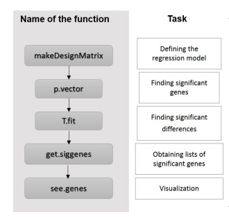
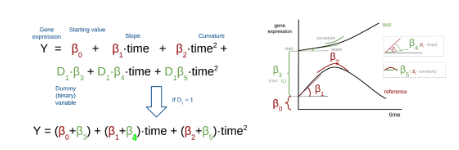

```{r setup, include=TRUE}
#.libPaths('/Users/zhangy68/R/R_4.4.2')
knitr::opts_chunk$set(warning = T, message = T,echo = F) 
```

```{r Initiate, results='hide'}
## initiate ---------------------------------------------------------
packages_to_load = c('dplyr','ggplot2','gplots','limma','stringr','usedist',
                     'cowplot','GGally','scales','rstatix','wesanderson', 'readxl',
                     'Biobase','reshape','edgeR','plotly','DT','tidyr','ComplexHeatmap','ggfun','ggrepel', 'maSigPro','DESeq2')
# Load packages without printing output
invisible(suppressPackageStartupMessages({
    lapply(packages_to_load, library, character.only = TRUE)
}))

# set variables 
setwd('./')
set.seed('123')
col21 <- rev(c("tomato1","darkblue","turquoise1","lightblue","darkred","mediumblue","purple","bisque",
               "greenyellow","yellow","violetred2","darkgreen","darkgoldenrod1","deeppink3","cadetblue4",
               "orchid2","seagreen3","purple4","dodgerblue2","red","gray27"))

```

```{r function section}
source('utils.R')
```

```{r load data}
exps = read.csv("../data/121224-JingWu-ACAT1_CD4T_RNAseq-counts-on-gene.txt", row.names = 1, sep = '\t',check.names = F)
pheno = read.csv('../data/metadata.csv')
# round raw count matrix. DESeq2 expects integers in the expression table
exps = as.data.frame(apply(exps,2,round))
```

# Input dataframe

## Phenotype data

```{r parse data,results='hide'}
rownames(pheno) = pheno$SampleID
pheno$PatientID = paste0('Patient',pheno$PatientID)
pheno$PatientID = as.factor(pheno$PatientID)
pheno$Conditions = factor(pheno$Conditions,c('Ctrl','ACAT1'))

names(exps) = pheno$SampleID[match(names(exps),pheno$SampleID.old)]
exps = select(exps, pheno$SampleID)

# sanity check --- order of samples matches in exps and pheno
stopifnot(all(names(exps) == rownames(pheno)))

saveRDS(exps,'../data/expression_allSamples.rds')
saveRDS(pheno,'../data/phenotype_allSamples.rds')
```

```{r show metadata}
edesign <- pheno %>%
  mutate(Control = ifelse(Conditions == 'Ctrl',1,0),
         ACAT1 = ifelse(Conditions == 'ACAT1',1,0),
         condition_time = paste0(Conditions,'-',Measurements),
         Replicate = ifelse(condition_time == 'Ctrl-Naive',1,
                            ifelse(condition_time == 'ACAT1-Naive',2,
                                   ifelse(condition_time == 'Ctrl-Ac_24h',3,
                                          ifelse(condition_time == 'ACAT1-Ac_24h',4,
                                                 ifelse(condition_time == 'Ctrl-Ac_72h',5,
                                                        ifelse(condition_time == 'ACAT1-Ac_72h',6,'NA'))))))) %>%
  select(Time,Replicate,Control,ACAT1)
edesign$Replicate = as.numeric(edesign$Replicate)

create_dt(pheno, 'Phenotype data')
create_dt(edesign,'Design matrix')

```

## Expression matrix preprocessing for maSigPro

Here we used the same preprocessing pipeline that we applied to the differential gene expression analysis for consistency. Briefly, we removed the lowly expressed genes and normalized data matrix with DESeq2 (estimateSizeFactors) method. After that, we also applied vst 

```{r deseq2 normalization}
setLabel = ' '
groups = pheno$Conditions
pair = pheno$PatientID
groupcol = getcol(groups,2)
# sanity check
try(if(!all(names(exps) == rownames(pheno))) stop("pheno data and expression data does not match each other"))

# remove lowly expressed genes
y <- DGEList(counts=exps,samples = pheno)
y$samples$group= y$samples$Conditions
keep.exprs <- filterByExpr(y) # filterByExpr will automatically filter base on grouping info stored in y$samples$group

exps.f = exps[keep.exprs,]
cat(paste0(nrow(exps.f),' genes are retained after filtering'))

# generate DESeq object
try(if(!all(names(exps.f) == rownames(pheno))) stop("pheno data and expression data does not match each other"))

# deseq2 normalization (note that design argument does not affect normalization at all)
exps.deseq2 <- exps.f %>% DESeqDataSetFromMatrix(countData =.,
                             colData = pheno,
                             design = formula(~ PatientID + Measurements + Conditions)) %>%
  estimateSizeFactors %>%
  counts(.,normalized =T) 

# generate plots
dds.normalized_counts.log = as.data.frame(cpm(exps.deseq2, 
                               log=TRUE, 
                               normalized.lib.sizes = FALSE,
                               prior.count=0.5))

plotDensities(dds.normalized_counts.log, group = groups, legend = 'topright',main = paste0(setLabel, " after filtering and DESeq Normalization"))
boxplot(value~variable, las=2, ylab = "Counts", xlab = NULL, cex.axis=0.75,
        melt(dds.normalized_counts.log), # melt just aggregate values in each column into a single colum and remove row names (using the sample names as row names instead)
        main=paste0(setLabel, " After Filtering and DESeq normalization"), col=groupcol)
```

# maSigPro analysis

## Overview of maSigPro algorithm

As the first step, maSigPro fits a model to each gene (please see the second figure attached), including all variables (beta coefficients). Using a threshold of R square and FDR defined by the user, genes that can be effectively modeled are retained.  Afterward, a second step is performed to select only those variables that significantly model the gene expression. This step involves computing the p value of each regression coefficient in the model (β values). Only variables with a p value below a specified threshold (indicating an influence in the model) are retained. Depending on the questions asked (e.g., gene expression changes along the time course; differential change along time-course between groups), the different groups of regression coefficients can be selected and clustered to show the trend of variation in the gene expression matrix.

```{r msp demonstration, echo=FALSE, out.width="60%"}

```

In this formula, the first part (in red) models the expression for the reference condition, while the subsequent terms model the expression for the test(s) condition(s) (in green). Dummy variables (D1) indicate the association with a specific experimental group, taking values of 0 or 1 based on the sample group.

```{r msp demonstration2, echo=FALSE, out.width="60%"}

```


Please see the following blogs and users-guide for the detailed information of maSigPro:

https://www.biobam.com/understanding-masigpro-timecourse-results/; 
https://bioconductor.org/packages/devel/bioc/vignettes/maSigPro/inst/doc/maSigProUsersGuide.pdf


## Regression matrix

Patients are used as replicates in this analysis. We used a quadratic regression model to allow some curvatures. As maSigPro does not perform normalization, we used the DESeq2 normalized/filtered matrix as input (the same one we used for our DESeq2 DEG analysis).

```{r masigpro design}
# create regression matrix
design <- make.design.matrix(edesign, degree = 2,time.col = 1,repl.col = 2,group.cols = c(3:4))
create_dt(design$dis,'Regression design matrix (degree = 2)')
```

## Regression analysis

Significance level = 0.05 
Pval adjust method = BH 
R square cutoff = 0.6

```{r msp modeling,message=FALSE,results='hide'}
# find genes with significant change over time
fit <- p.vector(data = exps.deseq2, # normalized data matrix
                design = design, # design matrix
                Q = 0.05, # significance level
                MT.adjust = "BH", # p val adj method
                min.obs = 0, # low expression gene filtering -- set to 0 to disable it since it's already filtered above
                counts = T, # data is RNA seq so set it as True, GLM is used. if it is microarray data or following gaussian distribution, set it to false)
                )
```

```{r msp modelign print}
cat(paste0('Total number of genes tested: ', fit$g, '\n'))
cat(paste0('Total number of genes effectively modeled (FDR < 0.05): ', fit$i,'\n'))
```

```{r msp coef sig test,message=FALSE,results='hide'}
tstep <- T.fit(fit, 
               step.method = "backward",
               nvar.correction = F, # the given significance level is NOT corrected by the number of variables in the model
               min.obs = 0,
               alfa = 0.05)
# obtain a list of significant genes
#groups: This will generate a list of significant genes for each experimental group.
#The list corresponding to the reference group will contain genes whose expression
#profile is significantly different from a 0 profile. The lists corresponding to the
#remaining experimental groups will contain genes whose profiles are different from
#the reference group.
sigs <- get.siggenes(tstep, rsq = 0.6, vars = "groups")
```

## Genes significantly change along the time course in control

```{r msp gene sig timecourse}
create_dt(sigs$sig.genes$Control$sig.pvalues,'Statistics of genes significantly change along the time course in control')
```
### Clustering {.tabset}

Iterative analysis for k (designated number of clusters) ranging from 2 to 9.

```{r msp clustering 1, results='asis',fig.height=8,fig.width=10}
for (k in 2:9){
  cat('#### k =', k, '\n')
  cat('\n')
  x = see.genes(sigs$sig.genes$Control, show.fit = T, dis =design$dis,
          cluster.method="kmeans" ,cluster.data = 1, k = k)
x2 = data.frame(genes = names(x$cut), cluster = x$cut)
print(htmltools::tagList(create_dt(x2,caption = paste0('cluster membership of genes at k = ',k))))
}

```


## Genes significantly different from control

```{r msp gene sig timecourse acat1}
create_dt(sigs$sig.genes$ACAT1vsControl$sig.pvalues,'Statistics of genes significantly different from control')

```

### Clustering {.tabset}

Iterative analysis for k (designated number of clusters) ranging from 2 to 4.

```{r msp clustering 2, results='asis',fig.height=8,fig.width=10}
for (k in 2:4){
  cat('#### k =', k, '\n')
  cat('\n')
  x = see.genes(sigs$sig.genes$ACAT1vsControl, show.fit = T, dis =design$dis,
          cluster.method="kmeans" ,cluster.data = 1, k = k)
x2 = data.frame(genes = names(x$cut), cluster = x$cut)
print(htmltools::tagList(create_dt(x2,caption = paste0('cluster membership of genes at k = ',k))))
}

```

## ACAT1 expression variation across time

```{r show acat1}
acat1 <- exps.deseq2[rownames(exps.deseq2)=="ACAT1", ]
PlotGroups (acat1, edesign = edesign, show.fit = T,dis = design$dis, groups.vector = design$groups.vector)
```

# Session Information

```{r save session}
sessionInfo()
save.image("../data/session_2_masigpro_Rimage.rdata")

```